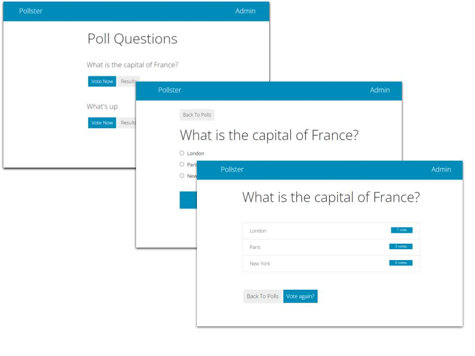

# reactpy-django-example



An example of using [reactpy-django] to create a simple, Django based, single 
page application (SPA). The project is a reworking of the introductory 
Django project: [Writing your first Django app]. If you are unfamiliar 
with Django get up to speed by working through this first.

## Usage

        git clone https://github.com/stevej2608/reactpy-django-example

        cd reactpy-django-example
        poetry install --no-root

        python manage.py runserver localhost:8000

Visit [http://localhost:8000](http://localhost:8000)


Use Django admin to add/remove questions. Visit [Admin](http://localhost:8000/admin/) or
simply click the **Admin** link, top-right in every page.

 Credentials:
 
        user:admin, password:superadmin

To change the admin password:

        python manage.py changepassword admin

## Features

- [X] No templates, all pages are coded in python alone.
- [X] Uses [reactpy_django.router] to dispatch page views.
- [X] Integrates with Django ORM using *use_query* and *use_mutation* hooks.
- [X] Can be used along side other Django apps

## Code Overview

 [reactpy-django] makes no changes to the Django ecosystem. The package provides
 a bridge that maps standard Django routes, as defined by urls, views 
 and templates, onto [reactpy] components. One or many such mapping can be 
 defined. 
 
 As with any Django app [urls.py](./polls/urls.py) defines a URL
 pattern that maps onto a [view](./polls/views.py). The
 view, in turn, loads a [template](./polls/templates/index.html), 
 
 The bridge between Django and [reactpy-django] is defined in the 
 template, in our case:

*[index.html](polls/templates/index.html)*
 ```
 

<body>
	
</body>
 ``` 

In this project just one *view/template* definition is used to
map between several url patterns defined in [urls.py](./polls/urls.py) and
the reactpy [spa_router](polls/spa_router.py). The router then unpacks
the requested URL and directs it to the relevant reactpy page.

Three pages (index, detail & results) together with a 404 page define the
the application. These are pure reactpy based. 

A container [page_container.py](polls/pages/page_container.py) wraps
each page in a common wrapper that contains the navbar etc.

### Django ORM

The polls ORM model used is the one created by [Writing your first Django app]. 

[reactpy-django] provides the hooks *use_query* and *use_mutation* to access the
ORM model. I found these a little cumbersome to use. A *use_query* wrapper is
defined in [common.py](./polls/pages/common.py). This converts loading and error
notifications into exceptions allowing the caller to be wrapped in 
a try/catch block.


## Links

* [reactpy]
* [reactpy-django]
        * [use-mutation](https://reactive-python.github.io/reactpy-django/latest/reference/hooks/#use-mutation)
* [django-unfold], Modern Django admin theme for seamless interface development
* [Writing your first Django app]
* [django-polls]
* [Bootstrap Pulse Theme]


[reactpy]: https://reactpy.dev/docs/index.html
[reactpy-django]: https://reactive-python.github.io/reactpy-django/latest/
[reactpy_django.router]: https://reactive-python.github.io/reactpy-django/latest/reference/router/
[Bootstrap Pulse Theme]: https://bootswatch.com/4/pulse/
[Voting System Project Using Django Framework]: https://www.geeksforgeeks.org/voting-system-project-using-django-framework/
[django-unfold]: https://github.com/unfoldadmin/django-unfold
[Writing your first Django app]: https://docs.djangoproject.com/en/5.0/intro/tutorial01/
[django-polls]: https://github.com/do-community/django-polls