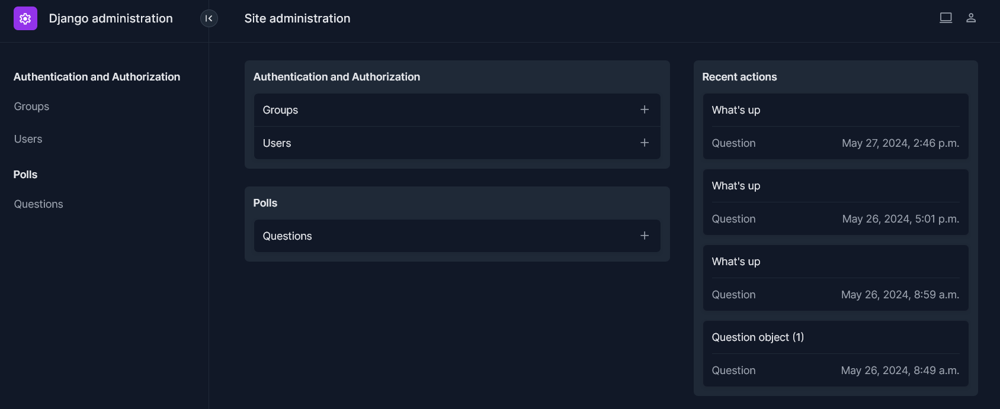

# django-basic

Steps used in the tutorial [Writing your first Django app]

        django-admin startproject project

        cd project
        python manage.py runserver

        python manage.py startapp polls

        python manage.py runserver localhost:8000

Visit [http://localhost:8000/polls/](http://localhost:8000/polls/)

        python manage.py migrate

        python manage.py makemigrations polls
        python manage.py sqlmigrate polls 0001
        python manage.py migrate

        python manage.py createsuperuser

Code up the project [django-polls], and then run the finished project:

        python manage.py runserver localhost:8000

Visit [http://localhost:8000/admin/](http://localhost:8000/admin/)

## Testing 

        python manage.py test polls

## Improvements

### Admin dashboard

Added [django-unfold]

### Added bootstrap based templates

Changed view templates for the ones in [Voting System Project Using Django Framework]

## reactpy-django

Steps to add [reactpy-django]

        python manage.py startapp stj

Follow getting started in [reactpy-django]

        python manage.py check

        python manage.py runserver localhost:8000

Visit [Example 1](http://localhost:8000/stj/)
Visit [Example 2](http://localhost:8000/stj/any/123/)
Visit [Example 3](http://localhost:8000/stj/integer/123/)
Visit [Example 4](http://localhost:8000/stj/path/123/)
Visit [Example 5](http://localhost:8000/stj/slug/xxx/)
Visit [Example 6](http://localhost:8000/stj/string/xxx/)
Visit [Example 7](http://localhost:8000/stj/uuid/075194d3-6885-417e-a8a8-6c931e272f00/)
Visit [Example 8](http://localhost:8000/stj/two_values/1/test/)
Visit [Example 9](http://localhost:8000/stj/abc/)
Visit [Example 10](http://localhost:8000/stj/star/one/)
Visit [Example 11](http://localhost:8000/stj/star/weapons?offset=0&limit=10)

Visit [http://localhost:8000/admin/](http://localhost:8000/admin/)
Visit [http://localhost:8000/polls/](http://localhost:8000/polls/)

# Links

* [reactpy-django]: https://reactive-python.github.io/reactpy-django/latest/
* [django-unfold], Modern Django admin theme for seamless interface development
* [Writing your first Django app]
* [django-polls]

[Voting System Project Using Django Framework]: https://www.geeksforgeeks.org/voting-system-project-using-django-framework/
[django-unfold]: https://github.com/unfoldadmin/django-unfold
[Writing your first Django app]: https://docs.djangoproject.com/en/5.0/intro/tutorial01/
[django-polls]: https://github.com/do-community/django-polls